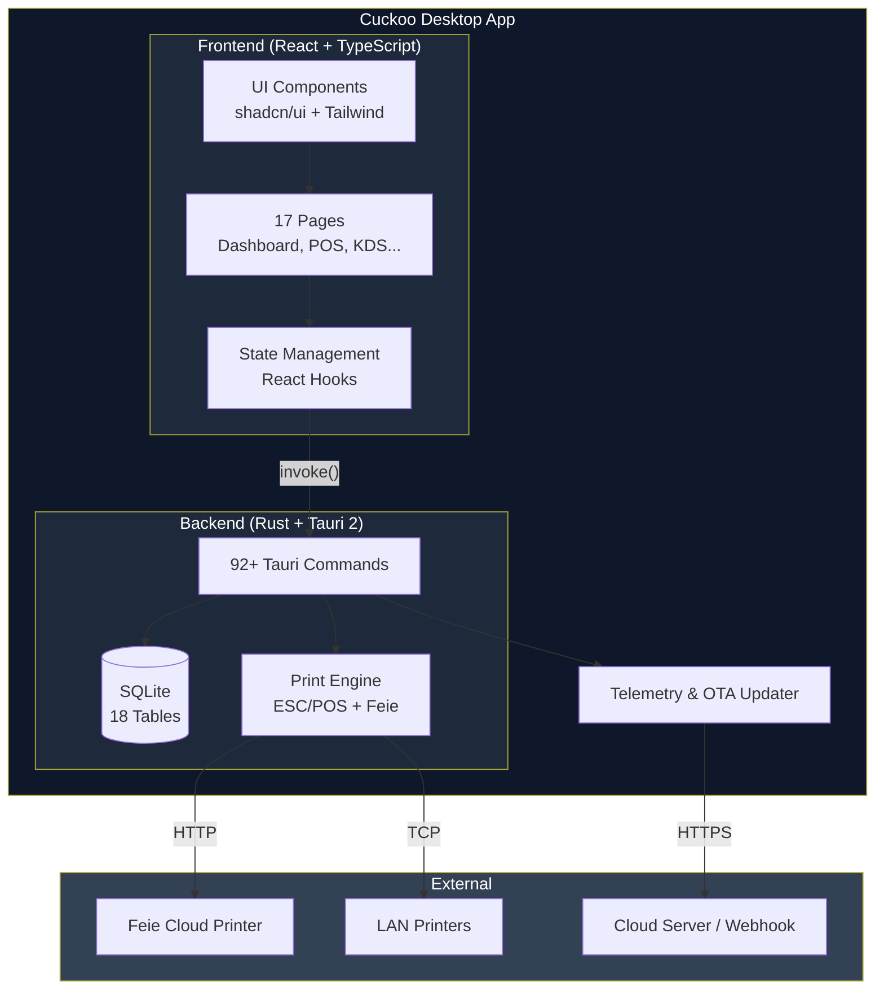
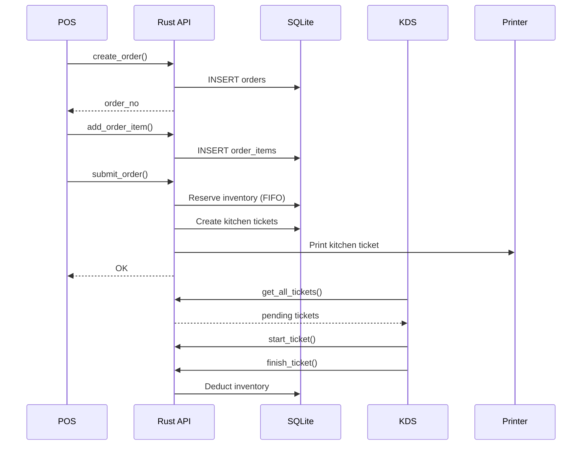
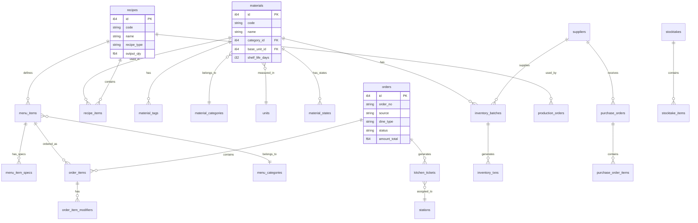
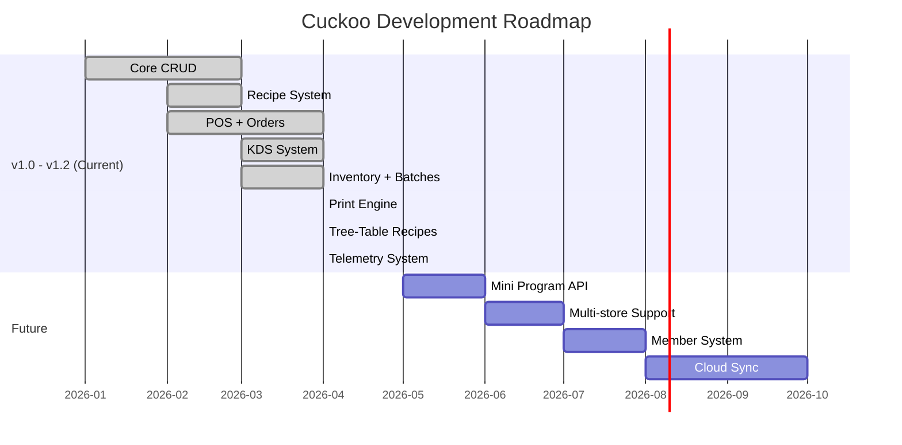

# Cuckoo — 配方驅動餐飲作業系統

> **Recipe-Driven Restaurant Operations System** — Local-first, offline-capable, desktop app built with Tauri 2.0

<div align="center">

[](https://tauri.app/)
[](https://react.dev/)
[](https://www.typescriptlang.org/)
[](https://www.rust-lang.org/)
[](https://www.sqlite.org/)
[](https://tailwindcss.com/)
[](LICENSE)
[](https://github.com/your-org/cuckoo/releases)

**[English](#english) · [中文](#中文)**

</div>

---

## Table of Contents / 目錄

- [Features / 功能亮點](#features--功能亮點)
- [Architecture / 架構](#architecture--架構)
- [Docs Index / 文檔索引](#docs-index--文檔索引)
- [Core Workflow / 核心流程](#core-workflow--核心流程)
- [Tech Stack / 技術棧](#tech-stack--技術棧)
- [Quick Start / 快速開始](#quick-start--快速開始)
- [Project Structure / 項目結構](#project-structure--項目結構)
- [Testing / 測試](#testing--測試)
- [Build & Release / 構建與發佈](#build--release--構建與發佈)
- [Database Schema / 數據庫結構](#database-schema--數據庫結構)
- [API Overview / API 概覽](#api-overview--api-概覽)
- [Roadmap / 開發路線](#roadmap--開發路線)
- [Contributing / 貢獻](#contributing--貢獻)
- [License / 許可](#license--許可)

---

## Features / 功能亮點

| English | 中文 |
|---------|------|
| **Recipe-Driven Inventory** — Auto-deduct ingredients via BOM recipes | **配方驅動庫存** — 通過 BOM 配方自動扣料 |
| **Batch Tracking** — FIFO/FEFO with expiry management | **批次追蹤** — FIFO/FEFO 效期管理 |
| **Semi-finished Products** — Production orders with yield tracking | **半成品管理** — 生產單與產出追蹤 |
| **POS System** — Cart, specs, modifiers, order submission | **POS 點單** — 購物車、規格、加料、提交 |
| **Kitchen Display (KDS)** — Station-based ticket workflow | **廚房顯示 (KDS)** — 工作站工單流程 |
| **Real-time Analytics** — Sales, gross profit, and consumption | **實時報表** — 銷售、毛利、消耗分析 |
| **Dependency Guard** — Prevent deletion of recipes in use (v1.2.2) | **引用保護** — 防止刪除/修改使用中的配方 (v1.2.2) |
| **Remote Telemetry** — Heartbeat & Error tracking for owners (v1.2.2) | **遠程監測** — 支持心跳與報錯遠程追蹤 (v1.2.2) |

---

## Architecture / 架構



> **Arch Evolution Strategy (v1.2.1+)**: Cuckoo operates as a robust **Local-First** application (unaffected by internet outages). It includes a built-in Telemetry/Heartbeat system and Tauri Auto-Updater to allow remote owners to track operations and push silent updates. Future versions (v2.0) will introduce an optional Cloud SaaS sync.

---

## Docs Index / 文檔索引

| 文档 | 说明 | 更新日期 |
|------|------|----------|
| [docs/backlog-and-fix-list.md](docs/backlog-and-fix-list.md) | 待开发与修复清单 (P0/P1/P2) | 2026-04-30 |
| [docs/test-plan-atomic-v1.2.2.md](docs/test-plan-atomic-v1.2.2.md) | 原子性功能测试方案 | 2026-04-30 |
| [docs/test-plan-user-journey-v1.2.2.md](docs/test-plan-user-journey-v1.2.2.md) | 用户旅程测试方案 | 2026-04-30 |
| [docs/api-design.md](docs/api-design.md) | API 设计文档 | - |
| [docs/comprehensive-audit-report-v1.2.2.md](docs/comprehensive-audit-report-v1.2.2.md) | v1.2.2 审计报告 | 2026-04-29 |

---

## Core Workflow / 核心流程

### Inventory Flow / 庫存流程


### Order-to-Kitchen Flow / 訂單到廚房流程



---

## Tech Stack / 技術棧

| Layer / 層 | Technology / 技術 | Version / 版本 |
|------------|-------------------|----------------|
| **Desktop Framework** | Tauri | 2.0 |
| **Frontend** | React | 18.3 |
| **Language** | TypeScript | 5.6 |
| **Styling** | Tailwind CSS + shadcn/ui | 4.2 |
| **Icons** | Lucide React | 1.8 |
| **Charts** | Recharts | 3.8 |
| **Routing** | React Router | 7.1 |
| **Backend** | Rust | 2021 Edition |
| **Database** | SQLite (rusqlite) | 0.32 |
| **Build** | Vite | 6.0 |
| **Testing** | Vitest + React Testing Library | 4.1 |

---

## Quick Start / 快速開始

### Prerequisites / 前置要求

- **Node.js** >= 18
- **Rust** >= 1.70 ([rustup](https://rustup.rs/))
- **Platform dependencies**: See [Tauri docs](https://tauri.app/start/prerequisites/)

### Development / 開發

```bash
# Clone repository
git clone https://github.com/your-org/cuckoo.git
cd cuckoo

# Install dependencies
npm install

# Start dev mode (Tauri + Vite HMR)
npm run tauri dev

# Or frontend only
npm run dev
```

---

## Testing / 測試

### Test Plans / 測試方案

本项目提供两套互补的测试方案：

| 文档 | 用途 | 覆盖范围 |
|------|------|----------|
| [docs/test-plan-atomic-v1.2.2.md](docs/test-plan-atomic-v1.2.2.md) | **原子性测试** - 功能点验证 | P0 核心安全、功能修复 |
| [docs/test-plan-user-journey-v1.2.2.md](docs/test-plan-user-journey-v1.2.2.md) | **用户旅程测试** - 角色操作验证 | 6 种角色、34 个完整场景 |

#### 原子性测试 (Atomic Tests)

针对已修复的 bug 和安全功能：

- **配方删除防呆**: T-001, T-002 — 删除前检查引用
- **成本计算递归保护**: T-003~T-006 — 深度计数、循环检测
- **遥测白名单**: T-007~T-009 — URL 校验
- **调试打印安全**: T-010~T-013 — 文件名过滤
- **循环引用拦截**: T-014~T-015 — 前端检测

详细见 [`docs/test-plan-atomic-v1.2.2.md`](docs/test-plan-atomic-v1.2.2.md)

#### 用户旅程测试 (User Journey Tests)

按角色划分的端到端测试：

| 角色 | 简称 | 测试用例 |
|------|------|----------|
| 店长 | UC-O | UC-O-001 ~ UC-O-008 |
| 收银员 | UC-C | UC-C-001 ~ UC-C-006 |
| 后厨 | UC-K | UC-K-001 ~ UC-K-005 |
| 仓管 | UC-S | UC-S-001 ~ UC-S-006 |
| 采购 | UC-B | UC-B-001 ~ UC-B-004 |
| 维护 | UC-A | UC-A-001 ~ UC-A-004 |

详细见 [`docs/test-plan-user-journey-v1.2.2.md`](docs/test-plan-user-journey-v1.2.2.md)

### 执行测试

```bash
# Run tests
npm test

# Run with coverage
npm run test:coverage

# Run once
npm run test:run
```

---

## Project Structure / 項目結構

```
cuckoo/
├── src/                          # React Frontend
│   ├── components/               #    UI Components
│   │   ├── ui/                   #       shadcn/ui primitives
│   │   ├── app-sidebar.tsx       #       Navigation sidebar
│   │   └── app-header.tsx        #       Top header bar
│   ├── pages/                    #    Page Components (17)
│   ├── hooks/                    #    Custom hooks
│   ├── lib/                      #    Utilities
│   ├── App.tsx                   #    Main app component
│   └── main.tsx                  #    Entry point
│
├── src-tauri/                    # Rust Backend
│   ├── src/
│   │   ├── main.rs               #    Tauri entry point
│   │   ├── lib.rs                #    App builder + commands
│   │   ├── commands.rs           #    92+ Tauri commands
│   │   └── database.rs           #    SQLite operations
│   ├── tauri.conf.json           #    Tauri config
│   └── Cargo.toml                #    Rust dependencies
```

---

## Build & Release / 構建與發佈

### macOS / macOS 構建

```bash
# Build for macOS (universal: Intel + Apple Silicon)
npm run tauri build -- --target universal-apple-darwin
```

**Output / 輸出**: `src-tauri/target/release/bundle/macos/Cuckoo.app`<br/>
**DMG**: `src-tauri/target/release/bundle/dmg/Cuckoo_*.dmg`

### Windows / Windows 構建

```bash
# Build for Windows (x64)
npm run tauri build -- --target x86_64-pc-windows-msvc
```

**Output / 輸出**: `src-tauri/target/release/bundle/msi/Cuckoo_*.msi`

---

## Database Schema / 數據庫結構



---

## Roadmap / 開發路線



### Version Plan / 版本計劃

| Version / 版本 | Focus / 重點 | ETA / 預計 |
|---------------|-------------|-----------|
| **v1.0** | Core features complete | 2026-03 |
| **v1.2.1** | Tree-Table Recipes & UI Refactoring | 2026-04 |
| **v1.2.2** | Telemetry, Fool-proofing & Dependency Guard | 2026-04 |
| **v1.3** | Mini program, Multi-store Alpha | 2026-07 |
| **v2.0** | Cloud sync, mobile apps | 2026-Q4 |

---

## Contributing / 貢獻

### How to Contribute / 如何貢獻

1. **Fork** the repository
2. **Create** your feature branch: `git checkout -b feature/amazing-feature`
3. **Commit** your changes: `git commit -m 'feat: add amazing feature'`
4. **Push** to the branch: `git push origin feature/amazing-feature`
5. **Open** a Pull Request

---

## License / 許可

This project is licensed under the **MIT License** — see the [LICENSE](LICENSE) file for details.

本項目採用 **MIT 許可證** — 詳情請參閱 [LICENSE](LICENSE) 文件。

---

<div align="center">

**Made with love by the Cuckoo Team**

[Back to Top](#cuckoo--配方驅動餐飲作業系統)

</div>
