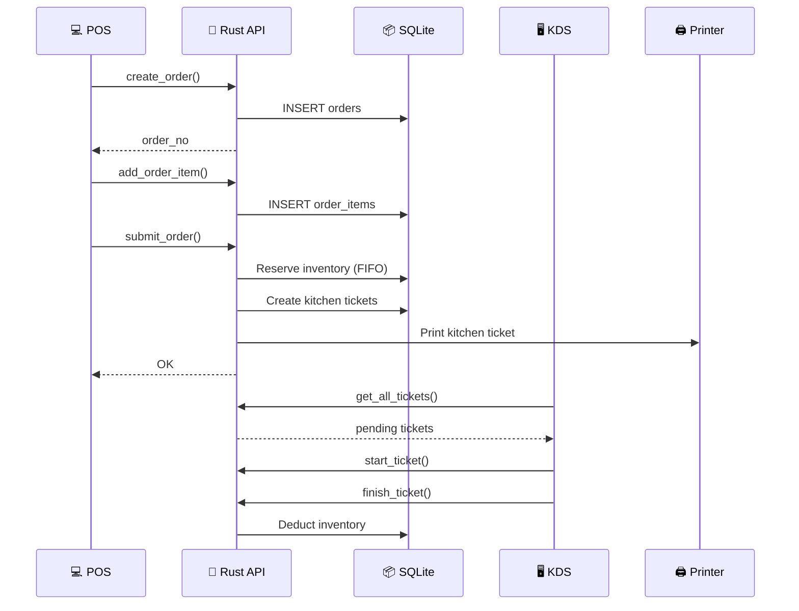
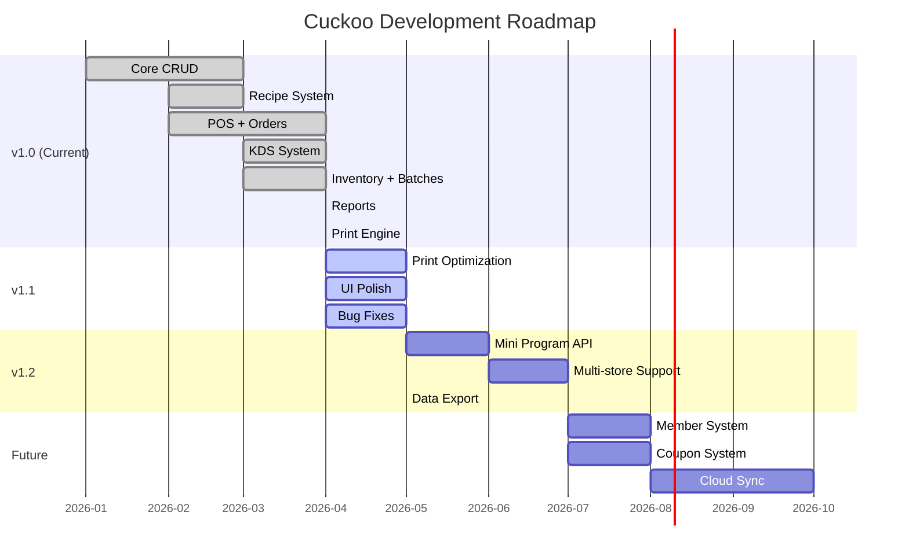

# 🐦 Cuckoo — 配方驅動餐飲作業系統

> **Recipe-Driven Restaurant Operations System** — Local-first, offline-capable, desktop app built with Tauri 2.0

<div align="center">

[](https://tauri.app/)
[](https://react.dev/)
[](https://www.typescriptlang.org/)
[](https://www.rust-lang.org/)
[](https://www.sqlite.org/)
[](https://tailwindcss.com/)
[](LICENSE)
[](https://github.com/your-org/cuckoo/releases)

**[English](#-english) · [中文](#-中文)**

</div>

---

## 📑 Table of Contents / 目錄

- [🌟 Features / 功能亮點](#-features--功能亮點)
- [🏗 Architecture / 架構](#-architecture--架構)
- [🔄 Core Workflow / 核心流程](#-core-workflow--核心流程)
- [📦 Tech Stack / 技術棧](#-tech-stack--技術棧)
- [🚀 Quick Start / 快速開始](#-quick-start--快速開始)
- [📁 Project Structure / 項目結構](#-project-structure--項目結構)
- [🛠 Build & Release / 構建與發佈](#-build--release--構建與發佈)
- [📊 Database Schema / 數據庫結構](#-database-schema--數據庫結構)
- [📋 API Overview / API 概覽](#-api-overview--api-概覽)
- [🗺 Roadmap / 開發路線](#-roadmap--開發路線)
- [🤝 Contributing / 貢獻](#-contributing--貢獻)
- [📄 License / 許可](#-license--許可)

---

## 🌟 Features / 功能亮點

| English | 中文 |
|---------|------|
| 🧾 **Recipe-Driven Inventory** — Auto-deduct ingredients via BOM recipes | 🧾 **配方驅動庫存** — 通過 BOM 配方自動扣料 |
| 📦 **Batch Tracking** — FIFO/FEFO with expiry management | 📦 **批次追蹤** — FIFO/FEFO 效期管理 |
| 🏭 **Semi-finished Products** — Production orders with yield tracking | 🏭 **半成品管理** — 生產單與產出追蹤 |
| 💻 **POS System** — Cart, specs, modifiers, order submission | 💻 **POS 點單** — 購物車、規格、加料、提交 |
| 🖥 **Kitchen Display (KDS)** — Station-based ticket workflow | 🖥 **廚房顯示 (KDS)** — 工作站工單流程 |
| 🛒 **Purchase Orders** — PO → Receive → Batch generation | 🛒 **採購訂單** — 採購→入庫→批次生成 |
| 📊 **Reports** — Sales, gross profit, consumption analytics | 📊 **報表分析** — 銷售、毛利、消耗分析 |
| 🖨 **Print Support** — ESC/POS, Feie cloud, LAN printers | 🖨 **打印支持** — ESC/POS、飛鵝雲、局域網打印 |
| 📋 **Stocktake** — Inventory counting with variance calculation | 📋 **盤點管理** — 庫存盤點與差異計算 |
| 🔔 **Alert System** — Low stock & expiry notifications | 🔔 **預警系統** — 低庫存與效期提醒 |

---

## 🏗 Architecture / 架構

```mermaid
graph TB
    subgraph Desktop["🖥 Cuckoo Desktop App"]
        subgraph Frontend["⚛️ Frontend (React + TypeScript)"]
            UI[UI Components<br/>shadcn/ui + Tailwind]
            Pages[17 Pages<br/>Dashboard, POS, KDS...]
            State[State Management<br/>React Hooks]
        end
        
        subgraph Backend["🦀 Backend (Rust + Tauri 2)"]
            Commands[92+ Tauri Commands]
            DB[(SQLite<br/>18 Tables)]
            Printer[Print Engine<br/>ESC/POS + Feie]
        end
        
        UI --> Pages
        Pages --> State
        State -->|invoke()| Commands
        Commands --> DB
        Commands --> Printer
    end
    
    subgraph External["🔌 External"]
        Feie[Feie Cloud Printer]
        LAN[LAN Printers]
    end
    
    Printer -->|HTTP| Feie
    Printer -->|TCP| LAN
    
    style Desktop fill:#0f172a,color:#fff
    style Frontend fill:#1e293b,color:#fff
    style Backend fill:#1e293b,color:#fff
    style External fill:#334155,color:#fff
```

---

## 🔄 Core Workflow / 核心流程

### Inventory Flow / 庫存流程


### Order-to-Kitchen Flow / 訂單到廚房流程



---

## 📦 Tech Stack / 技術棧

| Layer / 層 | Technology / 技術 | Version / 版本 |
|------------|-------------------|----------------|
| **Desktop Framework** | Tauri | 2.0 |
| **Frontend** | React | 18.3 |
| **Language** | TypeScript | 5.6 |
| **Styling** | Tailwind CSS + shadcn/ui | 4.2 |
| **Icons** | Lucide React | 1.8 |
| **Charts** | Recharts | 3.8 |
| **Routing** | React Router | 7.1 |
| **Backend** | Rust | 2021 Edition |
| **Database** | SQLite (rusqlite) | 0.32 |
| **Build** | Vite | 6.0 |
| **Testing** | Vitest + React Testing Library | 4.1 |

---

## 🚀 Quick Start / 快速開始

### Prerequisites / 前置要求

- **Node.js** >= 18
- **Rust** >= 1.70 ([rustup](https://rustup.rs/))
- **Platform dependencies**: See [Tauri docs](https://tauri.app/start/prerequisites/)

### Development / 開發

```bash
# Clone repository
git clone https://github.com/your-org/cuckoo.git
cd cuckoo

# Install dependencies
npm install

# Start dev mode (Tauri + Vite HMR)
npm run tauri dev

# Or frontend only
npm run dev
```

### Testing / 測試

```bash
# Run tests
npm test

# Run with coverage
npm run test:coverage

# Run once
npm run test:run
```

---

## 📁 Project Structure / 項目結構

```
cuckoo/
├── src/                          # ⚛️ React Frontend
│   ├── components/               #    UI Components
│   │   ├── ui/                   #       shadcn/ui primitives
│   │   ├── app-sidebar.tsx       #       Navigation sidebar
│   │   └── app-header.tsx        #       Top header bar
│   ├── pages/                    #    Page Components (17)
│   │   ├── dashboard-page.tsx    #       Main dashboard
│   │   ├── materials-page.tsx    #       Raw materials CRUD
│   │   ├── recipes-page.tsx      #       Recipe management
│   │   ├── pos-page.tsx          #       POS ordering
│   │   ├── kds-page.tsx          #       Kitchen display
│   │   ├── inventory-page.tsx    #       Inventory batches
│   │   ├── orders-page.tsx       #       Order history
│   │   ├── menu-page.tsx         #       Menu items
│   │   ├── reports-page.tsx      #       Analytics reports
│   │   ├── suppliers-page.tsx    #       Supplier management
│   │   ├── purchase-orders-page.tsx    # Purchase orders
│   │   ├── production-orders-page.tsx  # Production orders
│   │   ├── stocktakes-page.tsx   #       Stock counting
│   │   ├── attributes-page.tsx   #       Attribute templates
│   │   ├── material-states-page.tsx    # Material states
│   │   ├── print-templates-page.tsx    # Print templates
│   │   ├── print-preview-page.tsx      # Print preview
│   │   └── settings-page.tsx     #       System settings
│   ├── hooks/                    #    Custom hooks
│   ├── lib/                      #    Utilities
│   ├── test/                     #    Test setup
│   ├── App.tsx                   #    Main app component
│   ├── main.tsx                  #    Entry point
│   └── index.css                 #    Global styles
│
├── src-tauri/                    # 🦀 Rust Backend
│   ├── src/
│   │   ├── main.rs               #    Tauri entry point
│   │   ├── lib.rs                #    App builder + commands
│   │   ├── commands.rs           #    92+ Tauri commands
│   │   ├── database.rs           #    SQLite operations
│   │   └── printer.rs            #    Print engine
│   ├── icons/                    #    App icons
│   ├── tauri.conf.json           #    Tauri config
│   ├── Cargo.toml                #    Rust dependencies
│   └── build.rs                  #    Build script
│
├── docs/                         # 📚 Documentation
├── assets/                       # 🖼 Screenshots & assets
├── index.html                    #    HTML entry
├── package.json                  #    Node dependencies
├── vite.config.ts                #    Vite configuration
├── tailwind.config.js            #    Tailwind config
├── tsconfig.json                 #    TypeScript config
└── vitest.config.ts              #    Vitest config
```

---

## 🛠 Build & Release / 構建與發佈

### macOS / macOS 構建

```bash
# Build for macOS (universal: Intel + Apple Silicon)
npm run tauri build -- --target universal-apple-darwin

# Or separate architectures
npm run tauri build -- --target x86_64-apple-darwin   # Intel
npm run tauri build -- --target aarch64-apple-darwin   # Apple Silicon
```

**Output / 輸出**: `src-tauri/target/release/bundle/macos/Cuckoo.app`<br/>
**DMG**: `src-tauri/target/release/bundle/dmg/Cuckoo_*.dmg`

### Windows / Windows 構建

```bash
# Build for Windows (x64)
npm run tauri build -- --target x86_64-pc-windows-msvc
```

**Output / 輸出**: `src-tauri/target/release/bundle/msi/Cuckoo_*.msi`<br/>
**NSIS**: `src-tauri/target/release/bundle/nsis/Cuckoo_*.exe`

### Release Checklist / 發佈清單

- [ ] Update version in `package.json`, `src-tauri/Cargo.toml`, `tauri.conf.json`
- [ ] Run tests: `npm run test:run`
- [ ] Build: `npm run tauri build`
- [ ] Test the built app
- [ ] Create git tag: `git tag -a v1.0.0 -m "Release v1.0.0"`
- [ ] Push tag: `git push origin v1.0.0`
- [ ] Create GitHub Release with binaries

---

## 📊 Database Schema / 數據庫結構


### Tables / 數據表 (18)

| Table / 表 | Purpose / 用途 | Records / 記錄類型 |
|------------|---------------|-------------------|
| `units` | Measurement units | pc, kg, g, L, ml |
| `materials` | Raw materials | Ingredients, supplies |
| `material_categories` | Material categories | Vegetables, Meat, etc. |
| `material_tags` | Material tags | Organic, Local, etc. |
| `material_states` | Material states | Raw, Cooked, Prepped |
| `suppliers` | Suppliers | Vendor information |
| `recipes` | Recipes/BOM | Menu items, semi-finished |
| `recipe_items` | Recipe components | Ingredient lines |
| `menu_categories` | Menu categories | Appetizers, Mains, etc. |
| `menu_items` | Menu items | Dishes with pricing |
| `menu_item_specs` | Item specifications | Size, options |
| `orders` | Customer orders | All order types |
| `order_items` | Order line items | Ordered dishes |
| `order_item_modifiers` | Add-ons/removals | Extra, no onion |
| `kitchen_tickets` | KDS tickets | Station work orders |
| `stations` | Kitchen stations | Hot, Cold, Bar |
| `inventory_batches` | Stock batches | Lot tracking |
| `inventory_txns` | Stock transactions | All movements |
| `purchase_orders` | Purchase orders | Supplier orders |
| `purchase_order_items` | PO line items | Ordered materials |
| `production_orders` | Production orders | Semi-finished making |
| `stocktakes` | Stock count sheets | Inventory audits |
| `stocktake_items` | Stock count lines | Per-batch counts |
| `print_templates` | Print templates | Receipt designs |
| `printers` | Printer configs | Feie, LAN printers |
| `notifications` | System alerts | Low stock, expiry |

---

## 📋 API Overview / API 概覽

### Command Categories / 命令分類

| Category / 分類 | Count / 數量 | Examples / 示例 |
|-----------------|-------------|-----------------|
| **Materials / 原材料** | 8+ | `get_materials`, `create_material`, `update_material` |
| **Recipes / 配方** | 6 | `get_recipes`, `create_recipe`, `calculate_recipe_cost` |
| **Menu / 菜單** | 8+ | `get_menu_items`, `create_menu_item`, `toggle_menu_item_availability` |
| **Orders / 訂單** | 6 | `create_order`, `submit_order`, `cancel_order` |
| **KDS / 廚顯** | 5 | `get_all_tickets`, `start_ticket`, `finish_ticket` |
| **Inventory / 庫存** | 8+ | `get_inventory_summary`, `create_inventory_batch`, `adjust_inventory` |
| **Purchase / 採購** | 6 | `get_purchase_orders`, `receive_purchase_order` |
| **Production / 生產** | 5 | `get_production_orders`, `complete_production_order` |
| **Stocktake / 盤點** | 5 | `get_stocktakes`, `complete_stocktake` |
| **Reports / 報表** | 5 | `get_sales_report`, `get_gross_profit_report` |
| **Printers / 打印** | 12+ | `print_kitchen_ticket`, `print_batch_label`, `test_feie_printer` |
| **Notifications / 通知** | 6 | `get_notifications`, `check_and_create_alerts` |

---

## 🗺 Roadmap / 開發路線



### Version Plan / 版本計劃

| Version / 版本 | Focus / 重點 | ETA / 預計 |
|---------------|-------------|-----------|
| **v1.0** | Core features complete | ✅ Current |
| **v1.1** | Print optimization, UI polish | 2026-05 |
| **v1.2** | Mini program, multi-store | 2026-07 |
| **v2.0** | Cloud sync, mobile apps | 2026-Q4 |

---

## 🤝 Contributing / 貢獻

### How to Contribute / 如何貢獻

1. **Fork** the repository
2. **Create** your feature branch: `git checkout -b feature/amazing-feature`
3. **Commit** your changes: `git commit -m 'feat: add amazing feature'`
4. **Push** to the branch: `git push origin feature/amazing-feature`
5. **Open** a Pull Request

### Commit Convention / 提交規範

We follow [Conventional Commits](https://www.conventionalcommits.org/):

```
feat:     New feature / 新功能
fix:      Bug fix / 修復
docs:     Documentation / 文檔
style:    Code style / 代碼風格
refactor: Refactoring / 重構
test:     Tests / 測試
chore:    Maintenance / 維護
```

### Development Workflow / 開發流程


---

## 📄 License / 許可

This project is licensed under the **MIT License** — see the [LICENSE](LICENSE) file for details.

本項目採用 **MIT 許可證** — 詳情請參閱 [LICENSE](LICENSE) 文件。

---

<div align="center">

**Made with 🐦 by the Cuckoo Team**

[⬆ Back to Top](#-cuckoo--配方驅動餐飲作業系統)

</div>
